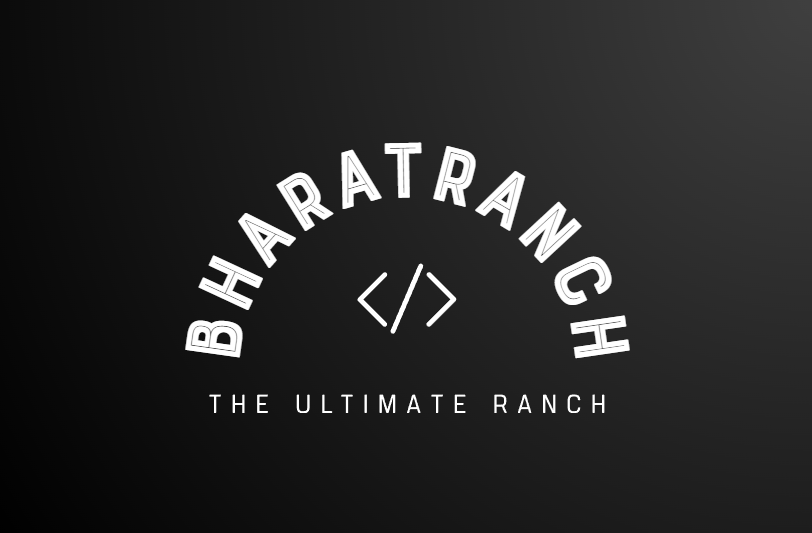
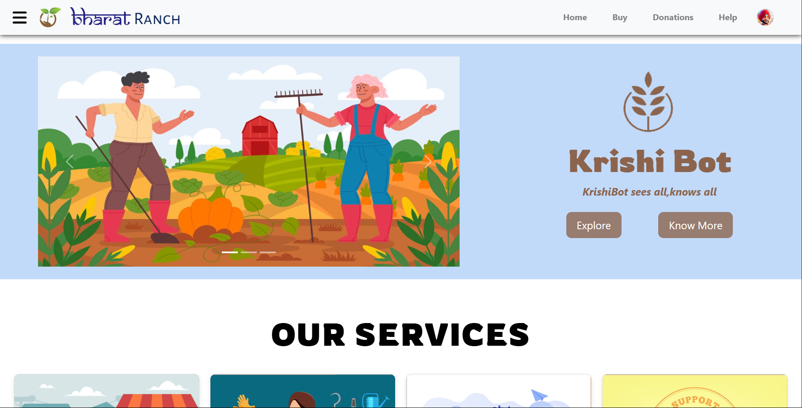
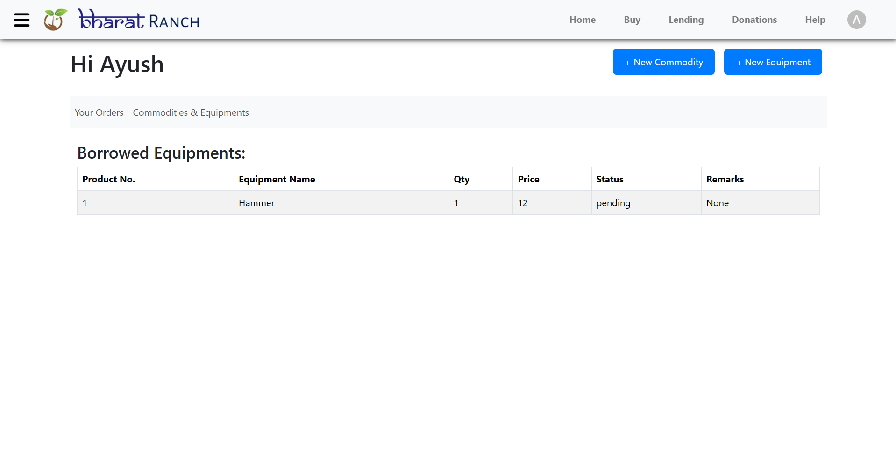
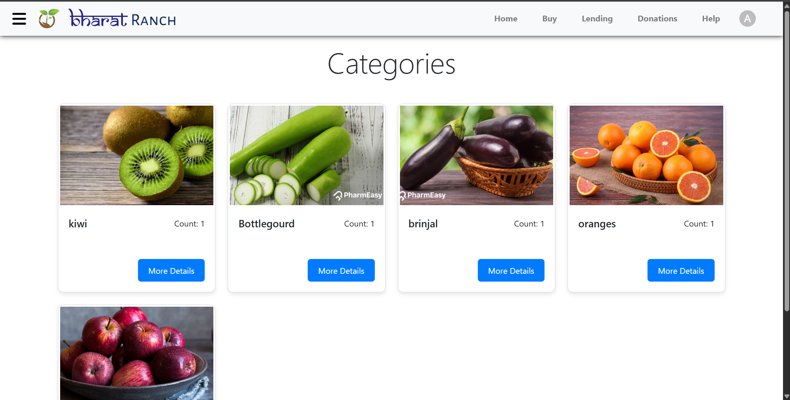
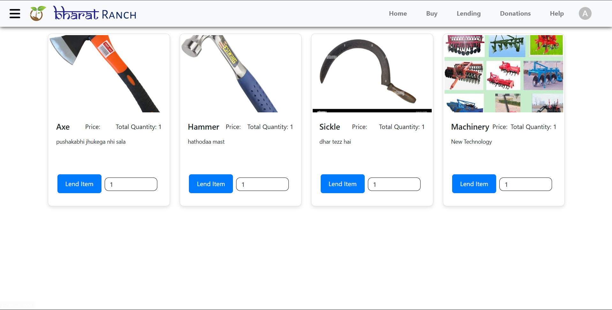
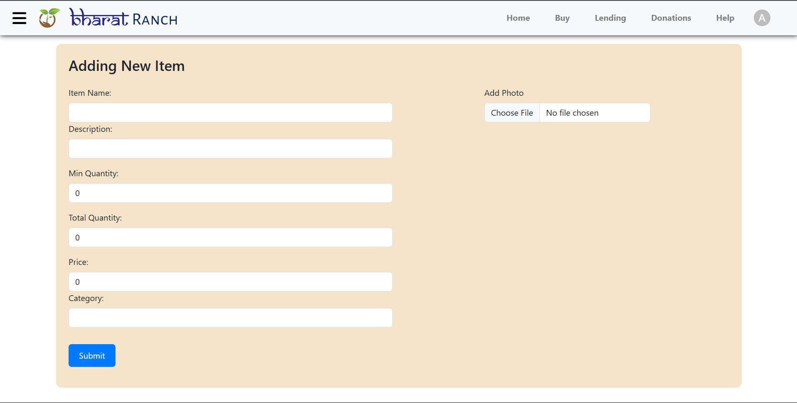

# BharatRanch: The Ultimate Ranch

 

## 🌱 Revolutionizing Agricultural Commerce

BharatRanch is a cutting-edge platform connecting farmers and buyers for bulk transactions with minimal margins. Our solution enables direct sales between farmers and dealers while providing seamless communication tools for negotiations and transactions.

**Key Features:**
- Direct farmer-to-dealer marketplace
- Bulk transaction capabilities
- Integrated chat system for negotiations
- Equipment lending/borrowing system
- Minimal commission structure

---

## 📋 Table of Contents
1. [Tech Stack](#-tech-stack)
2. [Features](#-features)
3. [Installation](#-installation)
4. [Configuration](#-configuration)
5. [Project Structure](#-project-structure)
6. [API Documentation](#-api-documentation)
7. [Screenshots](#-screenshots)
8. [Contributing](#-contributing)
9. [Contact](#-contact)

---

## 🛠 Tech Stack

### Frontend
- **React** (v18) - Frontend library
- **React Router** (v6) - Navigation
- **Material UI** (v5) - UI components
- **Bootstrap** (v5) - Styling framework
- **Recoil** - State management
- **Axios** - HTTP client

### Backend
- **Node.js** - Runtime environment
- **Express** - Web framework
- **MongoDB** - Database
- **Mongoose** - ODM for MongoDB
- **JWT** - Authentication
- **Cloudinary** - Image storage

### Development Tools
- **Vite** - Frontend build tool
- **Nodemon** - Development server
- **Postman** - API testing

---

## ✨ Features

### Marketplace
- Farmer product listings
- Bulk purchase requests
- Price negotiation tools
- Commodity categorization

### Equipment Sharing
- Equipment listing
- Borrow request system
- Rental management
- Availability tracking

### User Management
- Farmer/dealer profiles
- Role-based access
- Secure authentication
- Transaction history

### Communication
- Integrated chat system
- Notification center
- Order status updates

---

## 💻 Installation

### Prerequisites
- Node.js (v16+)
- MongoDB Atlas account or local installation
- Cloudinary account (for image storage)

### Backend Setup
1. Navigate to backend directory:
   ```bash
   cd backend
   ```
2. Install dependencies:
   ```bash
   npm install
   ```
3. Create `.env` file:
   ```
   MONGODB_URI=your_mongodb_connection_string
   JWT_SECRET=your_jwt_secret_key
   CLOUDINARY_CLOUD_NAME=your_cloudinary_name
   CLOUDINARY_API_KEY=your_cloudinary_key
   CLOUDINARY_API_SECRET=your_cloudinary_secret
   PORT=5000
   ```
4. Start server:
   ```bash
   npm start
   ```

### Frontend Setup
1. Navigate to project root:
   ```bash
   cd ..
   ```
2. Install dependencies:
   ```bash
   npm install
   ```
3. Create `.env` file:
   ```
   REACT_APP_API_BASE_URL=http://localhost:5000
   ```
4. Start development server:
   ```bash
   npm start
   ```

---

## ⚙ Configuration

### Environment Variables

**Backend:**
| Variable | Description | Required |
|----------|-------------|----------|
| `MONGODB_URI` | MongoDB connection string | Yes |
| `JWT_SECRET` | JWT token secret | Yes |
| `CLOUDINARY_*` | Cloudinary credentials | Yes |
| `PORT` | Server port (default: 5000) | No |

**Frontend:**
| Variable | Description | Required |
|----------|-------------|----------|
| `REACT_APP_API_BASE_URL` | Backend API base URL | Yes |

---

## 📂 Project Structure

```
bharat-ranch/
├── backend/               # Backend server
│   ├── config/           # Configuration files
│   ├── middleware/       # Authentication middleware
│   ├── models/           # MongoDB models
│   ├── routes/           # API routes
│   └── index.js          # Server entry point
├── public/               # Static assets
└── src/                  # Frontend source
    ├── components/       # React components
    ├── services/         # API services
    ├── state/            # Recoil state management
    ├── images/           # Image assets
    └── ...               # Other React files
```

---

## 📚 API Documentation

### Base URL
`http://localhost:5000/api/v1`

### Key Endpoints

**Authentication:**
- `POST /auth/register` - User registration
- `POST /auth/login` - User login

**Commodities:**
- `GET /commodities` - List all commodities
- `POST /commodities` - Add new commodity

**Equipment:**
- `GET /equipment` - List all equipment
- `POST /equipment` - Add new equipment

**Transactions:**
- `POST /buy-requests` - Create buy request
- `POST /borrow-requests` - Create borrow request


---

## 📸 Screenshots

### Homepage
 

### Farmer Dashboard
 

### Marketplace
 
 

### Adding Interface
 

---

## 🤝 Contributing

1. Fork the repository
2. Create your feature branch (`git checkout -b feature/AmazingFeature`)
3. Commit your changes (`git commit -m 'Add some AmazingFeature'`)
4. Push to the branch (`git push origin feature/AmazingFeature`)
5. Open a Pull Request

---

## 📧 Contact

**Project Team**  
- GitHub: [@jasjeev013](https://github.com/jasjeev013)
- Email: jasjeev99@gmail.com

**Project Link:** [https://github.com/jasjeev013/bharat-ranch](https://github.com/jasjeev013/bharat-ranch)

---


